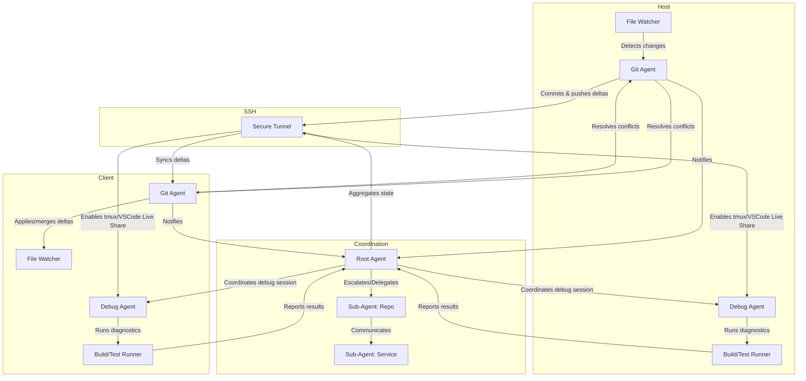

## Adaptive Git Sandbox & Agent Hierarchy (Mermaid)



AI: DO NOT TOUCH

# LiteBike

## Defaults and Tools

- **Ingress**: `s?w?lan*` → **Port 8888** ← **Egress**: `rmnet*` 
- **Linked tools**: `ifconfig`, `netstat`, `route`, `ip`

## Actual Codebase Specifications

### Binaries & Entrypoints
- Main binary: `litebike` (argv0-dispatch)
- Hardlink/symlink invocation: acts as `ifconfig`, `ip`, `route`, `netstat` (minimal syscall-only implementations)
- Additional commands: `probe`, `domains`, `carrier`, `radios`, `snapshot`, `watch`

### Command Reference

#### Network Utilities (Stable)
```bash
# Core network commands
litebike ifconfig [iface]       # List interfaces and addresses
litebike ip [args]              # IP utility emulation
litebike route                  # Print routing table
litebike netstat [args]         # Show socket states
litebike probe                  # Show best-effort egress selections for v4/v6
litebike domains                # Domain info utility
litebike carrier                # Carrier info utility
litebike radios [args]          # Radio info utility
litebike snapshot [args]        # Print config snapshot
litebike watch [args]           # Watch utility
```

#### Proxy Operations (Stable)
```bash
# Proxy server and testing
litebike proxy-server [port]    # Start unified proxy server (default: 8888)
litebike proxy-test [host port] # Test proxy functionality with RBCursive validation
litebike proxy-setup enable     # Configure seamless macOS proxy settings
litebike proxy-config [options] # Advanced proxy configuration
litebike version-check          # Check binary version, age, and capabilities
```

#### Remote Sync & SSH Operations (Stable)
```bash
# Enhanced SSH integration
litebike remote-sync list                    # List git remotes with SSH connectivity status
litebike remote-sync pull                    # Pull from temporary remotes
litebike remote-sync clean                   # Remove stale remotes
litebike remote-sync ssh-exec [host] <cmd>   # Execute command via SSH (auto-discover host)
litebike remote-sync ssh-mix                 # Mixed SSH ops: discovery + sync + exec
litebike remote-sync hostname-resolve [host] # Resolve SSH hostname connectivity
```

#### Pattern Matching (Stable)
```bash
# RBCursive pattern matching system
litebike pattern-match <type> <pattern> [file]  # Match glob/regex patterns
litebike pattern-glob <pattern> [file]          # Glob pattern matching
litebike pattern-regex <pattern> [file]         # Regex pattern matching
litebike pattern-scan <type> <pattern> [file]   # SIMD-accelerated pattern scanning
litebike pattern-bench [size]                   # Benchmark pattern performance
```

#### Experimental Features (Unstable)

**⚠️ Enable with:** `cargo build --features unstable`

These features are under active development and may change or be removed:

```bash
# Intel Console (Planned - Future Release)
litebike intel-console start [--port 9999]     # Start protocol reverse engineering console
litebike intel-console filter <expression>     # Apply Wireshark-style protocol filters
litebike intel-console trace <syscall-expr>    # Apply strace-style system call tracing
litebike intel-console analyze <session-id>    # Deep protocol analysis with RBCursive
litebike intel-console replay <session-id>     # Replay captured protocol sessions
litebike intel-console export <format>         # Export analysis results
```

**Planned Intel Console Features:**
- 🔬 **Protocol Interception**: MITM proxy mode for real-time analysis
- 🔍 **Wireshark-Style Filtering**: `http.method == GET && tcp.port == 80`
- 📊 **strace-Style Tracing**: `trace=%network,!futex`
- ⚡ **RBCursive Integration**: Anchor matrix visualization and pattern discovery
- 🎯 **DSEL Language**: Domain-specific expression language for complex filtering
- 📈 **Session Replay**: Capture, modify, and replay protocol exchanges

### Configuration
- Environment variables:
		- `LITEBIKE_BIND_PORT` (default: 8888)
		- `LITEBIKE_INTERFACE` (default: swlan0)
		- `LITEBIKE_LOG` (default: info)
		- `LITEBIKE_FEATURES` (comma-separated)
		- `EGRESS_INTERFACE` (default: auto)
		- `EGRESS_BIND_IP` (default: auto)
		- `LITEBIKE_BIND_ADDR` (optional)

### Protocol Support
- Multi-protocol detection on unified port (HTTP, SOCKS5, TLS, DoH, PAC/WPAD, Bonjour, UPnP)
- Protocols enumerated in code: HTTP, HTTPS, SOCKS5, TLS, DNS, DoH, PAC, WPAD, Bonjour, UPnP, and many more (see `src/types.rs`)

### System Utility Emulation
- All tools use direct syscalls via `libc` (no /proc, /sys, /dev on Android)
- Netlink sockets for routing info
- ioctl for interface enumeration
- Minimal Rust wrappers, C-style code for compatibility

### Testing & Examples
- Integration/unit/bench scaffolding in `tests/`
- Example: list interfaces and default gateway
		```rust
		use litebike::syscall_net::{list_interfaces, get_default_gateway};
		fn main() -> std::io::Result<()> {
			let ifaces = list_interfaces()?;
			for (name, iface) in ifaces {
				println!("{}: {:?}", name, iface.addrs);
			}
			if let Ok(gw) = get_default_gateway() {
				println!("Default gateway: {}", gw);
			}
			Ok(())
		}
		```

## Features

### Core Features (Stable)
- **RBCursive Protocol Engine:** SIMD-accelerated protocol detection with compile-time validation and anchor matrix parsing
- **Enhanced SSH Integration:** Full SSH client hostname and exec functionality subsumed into `remote-sync` command
- **Seamless macOS Proxy Setup:** Complete environment integration with LaunchAgent support and variable persistence
- **Pragmatic Proxy Testing:** Real-world proxy functionality testing with RBCursive protocol validation
- **Pattern Matching System:** High-performance glob/regex matching with SIMD acceleration and benchmarking
- **Versatile Proxying:** Multi-protocol proxy server handling HTTP, SOCKS5, TLS, PAC/WPAD, and more
- **Cross-Platform Support:** Works on Android/Termux, macOS, Linux without modification
- **Legacy Compatibility:** Drop-in replacement for `ifconfig`, `netstat`, `route`, `ip`

### Enhanced Capabilities
- **Bonjour-Powered Auto-Discovery:** Seamless, plug-and-play network experience
- **UPnP Support:** Automatic port forwarding when needed
- **Version Management:** Binary age tracking and compatibility checking
- **Universal Installation:** Standardized installation to `~/.litebike/bin/` for consistent access

## Network Interface Handling

LiteBike is designed to intelligently manage network interfaces for optimal proxying:

- **Default Ingress:** The proxy typically listens on WiFi interfaces, often matching patterns like `s?wlan*`.
- **Default Egress:** Outgoing traffic is routed through mobile data interfaces, commonly `rmnet*`, with built-in backoff logic for reliable connectivity.

## Architecture

### RBCursive Protocol Engine

LiteBike's core is built around the **RBCursive** engine - a SIMD-accelerated protocol detection and parsing system:

```
┌─────────────────────────────────────────────────────────────┐
│                    LiteBike Core                            │
├─────────────────────────────────────────────────────────────┤
│                RBCursive Engine                             │
│  ┌─────────────────────────────────────────────────────┐   │
│  │ Anchor Matrix System (SIMD-accelerated)            │   │
│  │ • Structural anchors: { } [ ] < >                  │   │
│  │ • Delimiter anchors: spaces, newlines, quotes      │   │
│  │ • Protocol markers: HTTP methods, version strings  │   │
│  └─────────────────────────────────────────────────────┘   │
│  ┌─────────────────────────────────────────────────────┐   │
│  │ Parse Combinators                                   │   │
│  │ • Zero-allocation parsing                           │   │
│  │ • Compile-time protocol validation                 │   │
│  │ • Pattern matching: glob, regex, custom            │   │
│  └─────────────────────────────────────────────────────┘   │
├─────────────────────────────────────────────────────────────┤
│              Protocol Handlers (Stable)                    │
│  ┌──────┐ ┌──────┐ ┌──────┐ ┌──────┐ ┌──────┐ ┌──────┐  │
│  │ HTTP │ │SOCKS5│ │ TLS  │ │ DNS  │ │ PAC  │ │ JSON │  │
│  └──────┘ └──────┘ └──────┘ └──────┘ └──────┘ └──────┘  │
├─────────────────────────────────────────────────────────────┤
│           System Integration Layer                          │
│  • Direct syscalls (no /proc, /sys dependencies)           │
│  • Netlink sockets for routing information                 │
│  • Cross-platform network interface enumeration            │
│  • Universal binary installation (~/.litebike/bin/)        │
└─────────────────────────────────────────────────────────────┘
```

### Key Architectural Principles

1. **Anchor Matrix Parsing**: SIMD instructions find all structural elements (spaces, quotes, brackets) in parallel, creating a navigable "coordinate system" over protocol data
2. **Zero-Copy Processing**: Anchors enable slicing data without allocation, using references to original bytes
3. **Compile-Time Validation**: Protocol acceptance is validated at compile-time through type-safe anchor patterns
4. **Universal Port Strategy**: Single port (8888) handles multiple protocols through intelligent detection

## WAM Block Stacking Architecture

### Taxonomical Foundation: WAM Axioms

LiteBike implements a Warren Abstract Machine (WAM) dispatch system with formal axioms supporting discrete sequence execution:

#### **Axiom 1: Unification Completeness**
```
∀ pattern P, command C: ∃! action A such that unify(P, C) → A
```
Every command pattern unifies to exactly one action in O(1) time through the WAM dispatch table.

#### **Axiom 2: Discrete Sequence Isolation**
```
∀ sequence S₁, S₂: S₁ ∩ S₂ = ∅ ∧ state(S₁) ⊥ state(S₂)
```
WAM sequences are disjoint with orthogonal state spaces, avoiding Job-style hierarchical complexity.

#### **Axiom 3: Element Persistence**
```
∀ element E, sequence S: E ∈ S → persistent(E) ∧ immutable(E.session_data)
```
CoroutineContext.Element maintains session state persistence across sequence boundaries.

#### **Axiom 4: Key Transform Purity**
```
∀ key K, element E: K(E) = E' ∧ side_effects(K) = ∅
```
CoroutineContext.Key functions are pure transformations without external side effects.

#### **Axiom 5: RBCursive Projection Isomorphism**
```
∀ parser P ∈ RBCursive: ∃! block B ∈ WAM such that π(P) = B
```
Every RBCursive parser projects to exactly one WAM block through isomorphic mapping.

### Discrete Sequence Implementation

#### **WAM Block Structure**
```rust
/// Fundamental WAM block following discrete sequence axioms
struct DiscreteWamBlock {
    sequence_id: usize,           // Axiom 2: Sequence isolation identifier
    element: SessionState,        // Axiom 3: Persistent session state
    key: TransformCode,          // Axiom 4: Pure transformation function
    next: Option<SequenceId>,    // Linear continuation (no hierarchy)
}

/// WAM dispatch table implementing Axiom 1
const WAM_DISPATCH_TABLE: &[(&str, CommandAction)] = &[
    // Network utilities - O(1) unification
    ("ifconfig", run_ifconfig),   // unify("ifconfig", cmd) → run_ifconfig
    ("route", run_route),         // unify("route", cmd) → run_route
    // Proxy operations
    ("proxy-server", run_proxy_server),
    ("socks5", run_socks5_sequence),
    // Pattern matching via RBCursive projection
    ("pattern-match", run_pattern_match),
];
```

#### **RBCursive → WAM Projection (Axiom 5)**
```rust
impl RBCursive {
    /// Project RBCursive parser to discrete WAM block
    fn project_to_wam(&self, protocol: ProtocolType) -> DiscreteWamBlock {
        match protocol {
            ProtocolType::Http(method) => DiscreteWamBlock {
                sequence_id: 0,  // HTTP sequence
                element: SessionState::from_stream_parser(self.http_parser()),
                key: TransformCode::http_transform(method),
                next: Some(SequenceId::continue_http()),
            },
            ProtocolType::Socks5 => DiscreteWamBlock {
                sequence_id: 1,  // SOCKS5 sequence  
                element: SessionState::from_stream_parser(self.socks5_parser()),
                key: TransformCode::socks5_transform(),
                next: Some(SequenceId::continue_socks5()),
            },
            // Other protocol projections...
        }
    }
}
```

#### **Sequence Execution Engine**
```rust
/// Execute discrete sequence following axioms 2-4
fn execute_sequence(seq_id: usize, initial_element: SessionState) -> SessionState {
    let sequence = &WAM_SEQUENCES[seq_id];  // Axiom 2: Isolated lookup
    let mut current_state = initial_element; // Axiom 3: Persistent state
    
    for block in sequence.blocks {
        // Axiom 4: Pure transformation
        current_state = (block.key)(current_state);
        
        // Axiom 2: No hierarchical side effects
        if let Some(next_id) = block.next {
            current_state = execute_sequence(next_id, current_state);
        }
    }
    
    current_state  // Axiom 3: State preservation
}
```

### CoroutineContext.Element.Key Pattern

#### **Element: Session-Based State**
```rust
/// Session state element (Axiom 3)
#[derive(Clone)]
pub struct SessionState {
    pub protocol_data: Vec<u8>,      // Immutable session data
    pub connection_state: ConnState,  // Connection metadata
    pub parsing_position: usize,     // Stream parser position
    pub continuation_point: Option<SequenceId>, // Next sequence reference
}

impl SessionState {
    /// Inherit from RBCursive StreamParser state
    pub fn from_stream_parser<T>(parser: &StreamParser<T>) -> Self {
        Self {
            protocol_data: parser.buffer().to_vec(),
            connection_state: ConnState::from_parser_state(&parser.state),
            parsing_position: parser.position(),
            continuation_point: None,
        }
    }
}
```

#### **Key: Pure Transform Functions**
```rust
/// Transform code keys (Axiom 4)
pub enum TransformCode {
    HttpTransform(fn(&SessionState) -> SessionState),
    Socks5Transform(fn(&SessionState) -> SessionState),
    PatternTransform(fn(&SessionState) -> SessionState),
}

impl TransformCode {
    /// Execute pure transformation (no side effects)
    pub fn apply(&self, state: &SessionState) -> SessionState {
        match self {
            Self::HttpTransform(f) => f(state),     // Pure HTTP processing
            Self::Socks5Transform(f) => f(state),   // Pure SOCKS5 processing  
            Self::PatternTransform(f) => f(state),  // Pure pattern matching
        }
    }
}
```

### Anti-Pattern: Job Hierarchy Avoidance

#### **Kotlin Job Pattern (Avoided)**
```kotlin
// ANTI-PATTERN: Creates unintended hierarchy complexity
class JobWithChildren : Job {
    val children: List<Job> = mutableListOf()  // Hierarchy complexity
    
    override suspend fun start() {
        children.forEach { child ->
            child.start()  // Sequential dependency cascade
        }
    }
}
```

#### **Discrete Sequence Pattern (Preferred)**
```rust
// PREFERRED: Flat sequence execution
struct DiscreteSequenceManager {
    sequences: HashMap<SequenceId, DiscreteSequence>,  // Flat map
    
    fn execute(&self, seq_id: SequenceId, state: SessionState) -> SessionState {
        let sequence = &self.sequences[&seq_id];  // Direct lookup
        sequence.blocks.iter().fold(state, |s, block| block.key.apply(&s))
    }
}
```

### Taxonomical Classification

#### **WAM Block Taxonomy**
```
WAM Architecture
├── Unification Engine (Axiom 1)
│   ├── Pattern Matching: O(1) dispatch table lookup
│   └── Command Resolution: Deterministic action binding
├── Discrete Sequences (Axiom 2)  
│   ├── Sequence Isolation: Disjoint state spaces
│   └── Linear Continuation: No hierarchical complexity
├── Session Management (Axiom 3)
│   ├── Element Persistence: State continuity across boundaries
│   └── State Immutability: Protection against corruption
├── Transform Purity (Axiom 4)
│   ├── Key Functions: Side-effect-free transformations
│   └── Functional Composition: Predictable state transitions
└── RBCursive Integration (Axiom 5)
    ├── Parser Projection: Isomorphic mapping to WAM blocks
    └── Protocol Unification: Compile-time validation integration
```

This taxonomical foundation ensures that WAM blocks maintain formal properties while providing practical benefits: O(1) dispatch, continuation simplicity, and seamless RBCursive integration.

