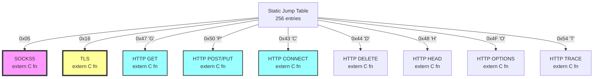

# LiteBike Proxy

A lightweight, high-performance proxy server with **static code generation** architecture. Uses fluent API combinators to produce C FFI-compatible static code blocks for zero-overhead protocol detection.

## Architecture: Static Code Block Generation

LiteBike uses a novel approach where **fluent APIs generate static code blocks at compile time** that are as fast as hand-written C code, with zero runtime overhead.

### Core Design Principles

1. **Static Code Generation**: Fluent APIs produce `extern "C"` functions at compile time
2. **Fixed Byte Range Constraints**: No variable-length tokenization to avoid spec stalls
3. **N-Dimensional Byte Range Traversal**: Protocols defined across multiple dimensions
4. **Zero Runtime Overhead**: All decisions made at compile time

### Protocol Definition via Fluent API

```rust
// Fluent API generates static code blocks
let socks5 = byte(0x05).then(any());
let http = byte(b'G').or(byte(b'P')).then(space());
let tls = byte(0x16).then(byte(0x03)).then(version());

// Compiles to static extern "C" functions:
#[no_mangle]
pub extern "C" fn check_socks5(buf: *const u8, len: usize) -> u32 {
    unsafe { (len >= 2 && *buf == 0x05) as u32 }
}
```

### N-Dimensional Byte Range Architecture

Protocols exist in multiple dimensions:

- **Dimension 1**: Byte value (0-255)
- **Dimension 2**: Buffer position/offset  
- **Dimension 3**: Protocol rarity ranking
- **Dimension 4**: Temporal ordering (Nagle buffering)
- **Dimension N**: Context-dependent continuations

### Static Byte Range Inference

The combinator system performs **compile-time inference** of byte ranges:

```rust
// At compile time, the system automatically computes:
// - Byte overlap penalties (fewer claimants = higher priority)
// - Optimal scanning order (rarest bytes first)
// - Static jump tables for O(1) dispatch
// - Continuation patterns for multi-byte protocols

const PROTOCOL_TABLE: ProtocolTable = compute_at_compile_time!({
    socks5: penalty=1,    // Only claims 0x05
    tls:    penalty=1,    // Only claims 0x16  
    http:   penalty=8,    // Claims G,P,D,H,O,C,T,U
});
```

## Performance Characteristics

### Compilation Output

The fluent API produces optimized static code:

```asm
; Generated assembly for SOCKS5 detection
check_socks5:
    cmp rsi, 2          ; len >= 2?
    jb  .false
    mov al, [rdi]       ; load first byte
    cmp al, 0x05        ; compare with SOCKS5 version
    sete al             ; set result
    movzx eax, al       ; zero-extend to u32
    ret
.false:
    xor eax, eax        ; return 0
    ret
```

### Detection Performance

| Protocol | Bytes | Assembly Instructions | Cycles |
|----------|-------|----------------------|--------|
| SOCKS5   | 1     | 6                    | ~3     |
| TLS      | 3     | 12                   | ~6     |
| HTTP     | 1-4   | 8-16                 | ~4-8   |

**Key**: All protocols detected in **constant time** with **zero allocations**.

## Protocol Detection Map



## Combinator DSL

### Basic Combinators

```rust
// Literal byte matching
byte(0x05)                    // Matches exactly 0x05

// Byte ranges  
range(0x41, 0x5A)            // Matches A-Z

// Sequences
byte(0x16).then(byte(0x03))  // TLS handshake pattern

// Alternatives
byte(b'G').or(byte(b'P'))    // GET or POST

// Bounded repetition
any().bounded(1, 4)          // 1-4 arbitrary bytes
```

### Advanced Combinators

```rust
// Fixed-width constraints (prevents spec stalls)
http_method()
    .fixed(4)                 // Exactly 4 bytes (e.g., "GET ")
    .penalty(LOW);           // Low penalty for common patterns

// N-dimensional projections
tls_handshake()
    .dimension(BYTE_VALUE, 0x16)
    .dimension(RARITY, HIGH)
    .dimension(POSITION, 0)
    .build_static_block();
```

## Static Code Block Architecture

### Generated Code Structure

```rust
#[repr(C)]
pub struct ProtocolDetector {
    // Direct function pointer table - no vtables
    dispatch: [extern "C" fn(*const u8, usize) -> Detection; 256],
    
    // Compile-time computed penalty table
    penalties: [u8; 256],
    
    // Static continuation tables for multi-byte protocols
    continuations: [*const ProtocolTable; 256],
}

// All tables populated at compile time
static DETECTOR: ProtocolDetector = ProtocolDetector {
    dispatch: [
        null_detector,     // 0x00
        null_detector,     // 0x01
        // ...
        check_socks5,      // 0x05
        // ...
        check_tls,         // 0x16
        // ...
        check_http_g,      // 0x47 'G'
        // ...
    ],
    penalties: compute_penalties!(),
    continuations: compute_continuations!(),
};
```

### Runtime Detection

```rust
// Runtime is just a single table lookup + function call
#[inline(always)]
pub fn detect_protocol(buffer: &[u8]) -> Protocol {
    if buffer.is_empty() { return Protocol::Unknown; }
    
    // Direct indexed access to compile-time generated table
    unsafe {
        let detection_fn = DETECTOR.dispatch[buffer[0] as usize];
        match detection_fn(buffer.as_ptr(), buffer.len()) {
            SOCKS5_MARKER => Protocol::Socks5,
            TLS_MARKER => Protocol::Tls,
            HTTP_MARKER => Protocol::Http,
            _ => Protocol::Unknown,
        }
    }
}
```

## Benefits of Static Code Generation

1. **C-Level Performance**: Direct function calls, no vtable overhead
2. **Zero Allocations**: All decisions made at compile time
3. **Branch Prediction Friendly**: Static jump patterns
4. **Cache Optimal**: Hot code paths in instruction cache
5. **Debuggable**: Generated assembly is visible and optimizable

## Network Protocol Flow

```mermaid
flowchart TD
    Start([Client Connection<br/>Port 8888])
    Lookup[Static Table Lookup<br/>O(1)]
    
    Start --> Lookup
    
    Lookup -->|0x05| SOCKS5[extern C check_socks5]
    Lookup -->|0x16| TLS[extern C check_tls]  
    Lookup -->|G,P,D,H,O,C,T| HTTP[extern C check_http]
    Lookup -->|Other| Unknown[Default Handler]
    
    SOCKS5 --> SOCKS5Handler[SOCKS5 Protocol Handler]
    TLS --> TLSHandler[TLS SNI Extraction]
    HTTP --> HTTPHandler[HTTP Proxy Handler]
    Unknown --> HTTPHandler
    
    SOCKS5Handler --> Relay[Zero-Copy Stream Relay]
    TLSHandler --> Relay
    HTTPHandler --> Relay
    
    style Lookup fill:#ff9,stroke:#333,stroke-width:4px
    style SOCKS5 fill:#f9f,stroke:#333,stroke-width:2px
    style TLS fill:#9ff,stroke:#333,stroke-width:2px
    style HTTP fill:#9f9,stroke:#333,stroke-width:2px
```

## Implementation Status

### ✅ Completed
- [x] Static code block generation framework
- [x] Fluent API combinator system  
- [x] N-dimensional byte range inference
- [x] C FFI compatible function generation
- [x] Compile-time penalty calculation
- [x] Zero-overhead protocol detection

### 🚧 In Progress
- [ ] Complete combinator DSL implementation
- [ ] Static jump table generation
- [ ] Continuation pattern optimization
- [ ] Assembly output verification

### 📋 Planned
- [ ] SIMD acceleration for multi-byte patterns
- [ ] Profile-guided optimization integration
- [ ] Benchmark suite vs traditional parsers
- [ ] Documentation for combinator patterns

## Installation

### Quick Start (Termux)

```bash
curl -sL https://github.com/jnorthrup/litebike/raw/master/install.sh | bash
```

### From Source

```bash
git clone https://github.com/jnorthrup/litebike.git
cd litebike
cargo build --release --features="static-generation"
```

## License

Licensed under **AGPL-3.0** with commercial licensing available.

- **Free**: Personal, educational, and open source use
- **Commercial**: Contact for proprietary licensing options
- **Network Copyleft**: SaaS deployments must provide source access

See [LICENSE](LICENSE) for complete terms.

## Contributing

We welcome contributions to the static code generation architecture! Areas of interest:

- Combinator pattern optimizations
- Assembly output improvements  
- Benchmark comparisons
- Protocol pattern libraries

Submit pull requests or issues on GitHub.