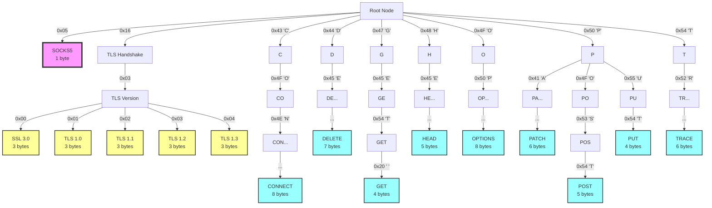

# LiteBike Proxy

A lightweight, high-performance proxy server written in Rust, designed for mobile and embedded environments. Supports both HTTP/HTTPS and SOCKS5 protocols with intelligent network interface routing and comprehensive protocol detection using Patricia Trie-based pattern matching.

## Patricia Trie Protocol Detection

LiteBike uses an optimized Patricia Trie (radix tree) for ultra-fast protocol detection on port 8080. This enables single-port universal proxy support with minimal overhead.

### Protocol Detection Map



### Detection Performance

| Protocol | Bytes Needed | Detection Time | Pattern |
|----------|--------------|----------------|---------|
| SOCKS5   | 1            | O(1)          | `0x05` |
| TLS 1.0  | 3            | O(3)          | `0x16 0x03 0x01` |
| TLS 1.1  | 3            | O(3)          | `0x16 0x03 0x02` |
| TLS 1.2  | 3            | O(3)          | `0x16 0x03 0x03` |
| TLS 1.3  | 3            | O(3)          | `0x16 0x03 0x04` |
| HTTP GET | 4            | O(4)          | `GET ` |
| HTTP PUT | 4            | O(4)          | `PUT ` |
| HTTP POST| 5            | O(5)          | `POST ` |
| HTTP HEAD| 5            | O(5)          | `HEAD ` |
| HTTP DELETE | 7         | O(7)          | `DELETE ` |
| HTTP CONNECT | 8        | O(8)          | `CONNECT ` |
| HTTP OPTIONS | 8        | O(8)          | `OPTIONS ` |

### Extended Protocol Support

The Patricia Trie can be extended for additional protocols:

```
Future Extensions:
├─ 0x00-0x04 → SOCKS4/4A (version bytes) 
├─ 0x15 → TLS Alert Protocol
├─ 0x17 → TLS Application Data
├─ 0x80-0x8F → Legacy SSL 2.0
├─ 'S' → Could map to:
│   ├─ "SSH-" → SSH Protocol
│   └─ "STARTTLS" → SMTP/IMAP upgrade
├─ 0x0D 0x0A → Could detect:
│   └─ "PROXY " → HAProxy PROXY protocol
└─ Binary patterns for:
    ├─ WebSocket upgrade sequences
    ├─ HTTP/2 preface ("PRI * HTTP/2.0")
    ├─ QUIC/HTTP/3 patterns
    └─ gRPC binary headers
```

### Memory Efficiency

The Patricia Trie structure uses approximately:
- **Base overhead**: ~200 bytes for the trie skeleton
- **Per node**: 24 bytes (HashMap entry + protocol enum)
- **Total for current protocols**: ~1KB
- **Lookup performance**: O(k) where k = protocol prefix length

### Implementation Details

```rust
// Trie node structure
struct TrieNode {
    children: HashMap<u8, Box<TrieNode>>,  // 24 bytes base
    protocol: Option<Protocol>,             // 2 bytes enum
    prefix_len: usize,                      // 8 bytes
}

// Protocol detection flow
1. Read first packet (up to 4096 bytes)
2. Traverse trie byte-by-byte
3. Return longest matching protocol
4. Fallback to bitwise quick detection
5. Route to appropriate handler
```

### Binary Protocol Formats

#### SOCKS5 Detection
```
Byte 0: Version (0x05)
├─ Detected immediately
└─ No further bytes needed
```

#### TLS/SSL Detection

```mermaid
sequenceDiagram 
    participant C as Client 
    participant P as Proxy (8080)
    participant S as Target Server
    
    C->>P: TLS Client Hello
    Note over P: Detect 0x16 0x03 0xXX
    Note over P: Extract SNI hostname
    P->>P: Parse extensions for 0x0000
    P->>S: Connect to hostname:443
    P->>S: Forward Client Hello
    S->>P: Server Hello
    P->>C: Forward Server Hello
    C<->P: TLS Handshake Complete
    C<->P<->S: Encrypted Application Data
```

##### TLS Client Hello Structure

```mermaid
graph LR
    subgraph "TLS Record Header (5 bytes)"
        A[0x16<br/>Type] --> B[0x03 0x0X<br/>Version] --> C[Length<br/>2 bytes]
    end
    
    subgraph "Handshake Header (4 bytes)"
        C --> D[0x01<br/>Hello] --> E[Length<br/>3 bytes]
    end
    
    subgraph "Client Hello Body"
        E --> F[Version<br/>2 bytes]
        F --> G[Random<br/>32 bytes]
        G --> H[Session ID<br/>Variable]
        H --> I[Cipher Suites<br/>Variable]
        I --> J[Compression<br/>Variable]
        J --> K[Extensions<br/>Variable]
    end
    
    subgraph "SNI Extension"
        K --> L[Type: 0x0000<br/>2 bytes]
        L --> M[Length<br/>2 bytes]
        M --> N[List Length<br/>2 bytes]
        N --> O[Type: 0x00<br/>1 byte]
        O --> P[Name Length<br/>2 bytes]
        P --> Q[Hostname<br/>Variable]
    end
    
    style A fill:#f96,stroke:#333,stroke-width:2px
    style D fill:#f96,stroke:#333,stroke-width:2px
    style L fill:#9f6,stroke:#333,stroke-width:2px
    style Q fill:#69f,stroke:#333,stroke-width:2px
```



#### HTTP Method Detection
```
All HTTP methods end with space (0x20):
- "GET "     = 0x47 0x45 0x54 0x20
- "POST "    = 0x50 0x4F 0x53 0x54 0x20
- "CONNECT " = 0x43 0x4F 0x4E 0x4E 0x45 0x43 0x54 0x20
```

### Universal Protocol Flow on Port 8080


## Core Components

### PAC Server (Port 8888)
- Serves proxy auto-configuration file
- URL: `http://$TERMUX_HOST:8888/proxy.pac`
 

### Universal HTTP Proxy (Port 8080)
- Handles HTTP, HTTPS, and CONNECT tunneling
- Protocol detection on single port
- Bridges WiFi (swlan0) to mobile data (rmnet)

### Compliance Ports
Individual protocol ports for strict compliance requirements:
- **1080**: SOCKS5 (RFC 1928 compliant)
- **8443**: Direct TLS proxy
- **3128**: Squid-compatible HTTP
- **1900**: UPnP/SSDP discovery

## Client Configuration

### Automatic (via PAC)
```
Proxy Auto-Config URL: http://$TERMUX_HOST:8888/proxy.pac
```

### Manual
```
HTTP Proxy:  $TERMUX_HOST:8080
HTTPS Proxy: $TERMUX_HOST:8080
SOCKS Proxy: $TERMUX_HOST:1080
```

## Sample PAC File
```javascript
function FindProxyForURL(url, host) {
  if (isInNet(host, "10.0.0.0", "255.0.0.0"))
    return "DIRECT";
  return "PROXY $TERMUX_HOST:8080; SOCKS $TERMUX_HOST:1080; DIRECT";
}
```

<<<<<<< HEAD
## Proxy Bridge Script

The included `scripts/proxy-bridge` script provides comprehensive proxy management:

- Auto-discovery of gateway IPs
- SSH remote server startup
- System-wide proxy configuration for macOS/Linux
- Developer tool integration (git, npm, curl, VSCode, etc.)

See [scripts/proxy-bridge](scripts/proxy-bridge) for detailed usage.

## Architecture

Litebike uses Tokio for async I/O and implements both HTTP CONNECT tunneling and SOCKS5 protocol handling in a single binary. The design prioritizes:

1. **Performance**: Minimal overhead, efficient buffer management
2. **Compatibility**: Works with mobile platform restrictions
3. **Flexibility**: Configurable routing for complex network setups
4. **Simplicity**: Single binary, no external dependencies

## Installation

### Termux (Android)
```bash
curl -sL https://github.com/jnorthrup/litebike/raw/master/termux-package/build-on-termux.sh | bash
```

### Desktop/Server
Requirements: Rust 1.70+ with cargo

```bash
git clone https://github.com/jnorthrup/litebike.git
cd litebike
cargo build --release
```

## License

MIT License - See LICENSE file for details

## Contributing

Contributions welcome! Please submit pull requests or issues on GitHub.
=======
## Termux-Specific Notes
- $TERMUX_HOST: Auto-detected swlan0 IP address
- Ingress: WiFi interface (swlan0)
- Egress: Mobile data (rmnet_data*)
- Purpose: Share mobile data via WiFi proxy bridge
>>>>>>> 102b8e2 (feat: Add Termux ARM64 build and complete proxy implementation)
