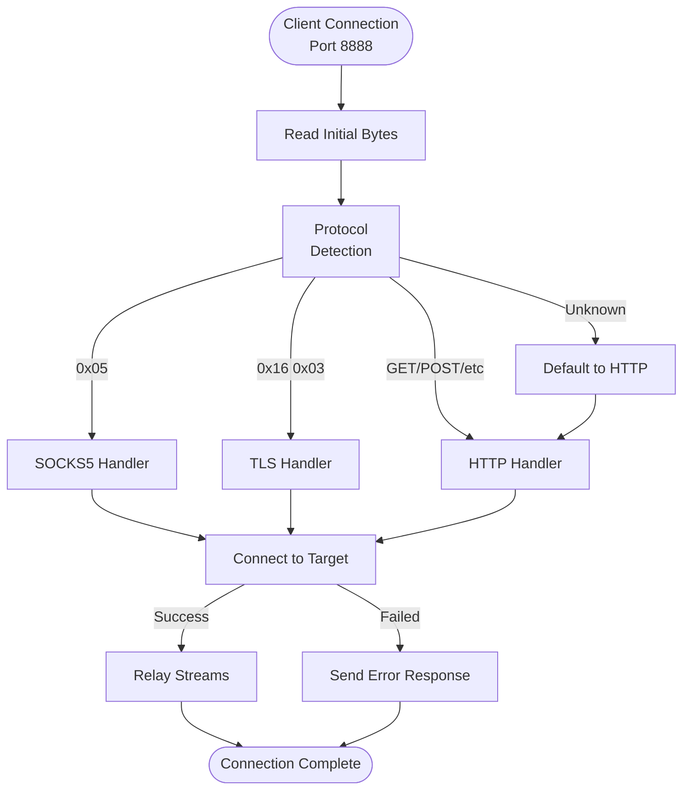

# LiteBike: Your Network's "Print" Button for Proxies

LiteBike is a powerful network toolkit written in Rust. Its mission is to make complex proxying and network bridging as simple and automatic as adding a printer to your network. It's designed to "just work" in the background, handling intricate configurations for you.

This includes intelligently managing network interfaces, with `s?wlan*` typically serving as the default ingress (listening) interface and `rmnet*` as the default egress (outgoing) interface, utilizing backoff logic for reliable mobile data routing.

## The Core Idea: Zero-Configuration Networking

At the heart of LiteBike is **Bonjour (mDNS)**, the same technology that makes printers and file shares appear automatically on your network. This allows LiteBike to be a true zero-configuration tool:

- **Auto-Discovery:** LiteBike instances automatically find each other on the local network. No need to manually enter IP addresses or hostnames.
- **Bidirectional Tunneling:** Easily create a network bridge where your Mac can use your phone's mobile data, or your phone can use your Mac's connection—traffic flows wherever it's needed.
- **Unified Proxy on Port 8888:** s?wlan* is default ingress rmnet* is egress with backoff
- **Effortless Client Setup:** Automatically generates WPAD and PAC files, allowing devices like your Mac to configure themselves to use the proxy with zero clicks.

## Features

- **Bonjour-Powered Auto-Discovery:** The key to a seamless, plug-and-play experience.
- **Versatile Proxying:** A robust, multi-protocol proxy server that handles modern web traffic.
- **UPnP Support:** Enables automatic port forwarding when needed.
- **`proxy-bridge` Script:** A companion script that automates the tedious task of setting and clearing proxy configurations in all your common shell (`.*rc`) files.
- **Cross-Platform**: Works on Android/Termux, macOS, Linux without modification.
- **Legacy Compatibility**: Drop-in replacement for `ifconfig`, `netstat`, `route`, `ip`.

## Network Interface Handling

LiteBike is designed to intelligently manage network interfaces for optimal proxying:

- **Default Ingress:** The proxy typically listens on WiFi interfaces, often matching patterns like `s?wlan*`.
- **Default Egress:** Outgoing traffic is routed through mobile data interfaces, commonly `rmnet*`, with built-in backoff logic for reliable connectivity.

s?wlan* is default ingress rmnet* is egress with backoff

## Installation

### Termux (Android)

```bash
curl -sL https://github.com/jnorthrup/litebike/raw/master/termux-package/build-on-termux.sh | bash
```

### Desktop/Server

Requirements: Rust 1.70+ with cargo

```bash
git clone https://github.com/jnorthrup/litebike.git
cd litebike
cargo build --release
# Add to your path
export PATH="$(pwd)/target/release:$PATH"
```

## Usage Examples

### Modern Interface

```bash
# Network management
litebike net interfaces list
litebike net routes list --ipv4
litebike net stats connections --listening
litebike net discover hosts --range 192.168.1.0/24
litebike net discover peers

# Proxy operations
litebike proxy server --port 8080 --bind 0.0.0.0
```

### Legacy Compatibility

```bash
# These work exactly like traditional utilities
ifconfig -a
netstat -tuln
route
ip addr show
```

## Technical Architecture

LiteBike uses Tokio for async I/O. The unified proxy port, typically 8888, handles all protocols through a sophisticated scheduling system built on **parse combinators**.

This approach allows LiteBike to transcribe predicate patterns for various protocols (like SOCKS5, TLS, and HTTP) and dynamically schedule their recognition from the initial bytes of an incoming connection. It is an efficient and extensible method for managing multiple protocols on a single port. The system is also designed to be environment-aware, adapting to constraints like the absence of a `/proc` filesystem on Android.

### Unified Executable and System Utility Emulation

The project's architecture is evolving towards a single, unified `litebike` executable. This binary will subsume the functionality of the separate `netutils` program, while retaining the ability to emulate standard system utilities.

By calling the `litebike` executable via a hard-link or symlink with a name like `ifconfig`, `netstat`, `route`, or `ip`, it will automatically detect the invocation name and execute a minimal, syscall-only implementation of that utility. This provides two main benefits:

1.  **Simplified Deployment:** A single executable simplifies installation and reduces the project's footprint.
2.  **Maximum Compatibility:** It ensures that LiteBike can function in restrictive environments where traditional utilities are unavailable or their use is mediated, by providing its own implementation of these essential tools. The `netstat` emulation, for example, provides columnar output including `Recv-Q` and `Send-Q` by directly querying the kernel via netlink sockets.



## License

**Licensed under AGPL-3.0** with commercial licensing available.

### AGPL-3.0 (Default)

- **Free** for personal, educational, and research use.
- **Free** for commercial use **if** you open-source your entire application.
- **Network Copyleft**: If you run a modified version on a server for others to access, you **must** make your source code available.

### Commercial License Alternative

- **Proprietary Use**: Allows for use in proprietary applications without open-source requirements.
- **Priority Support**: Access to priority support and consulting services.

**Contact**: For commercial licensing, please open a GitHub issue.
