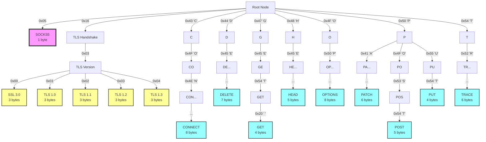
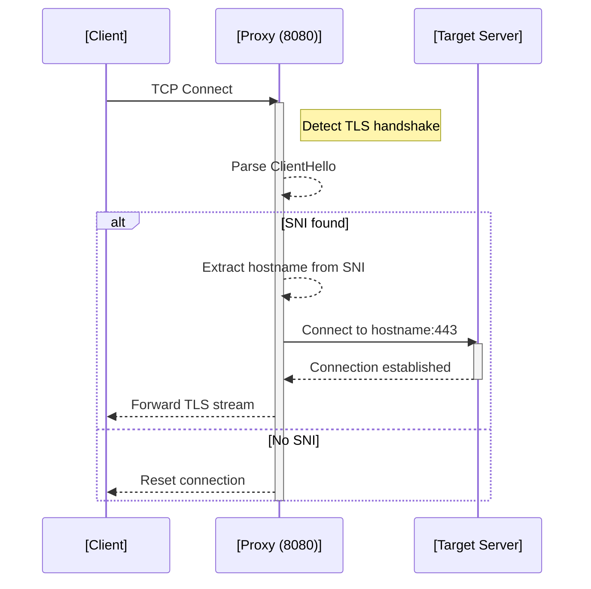
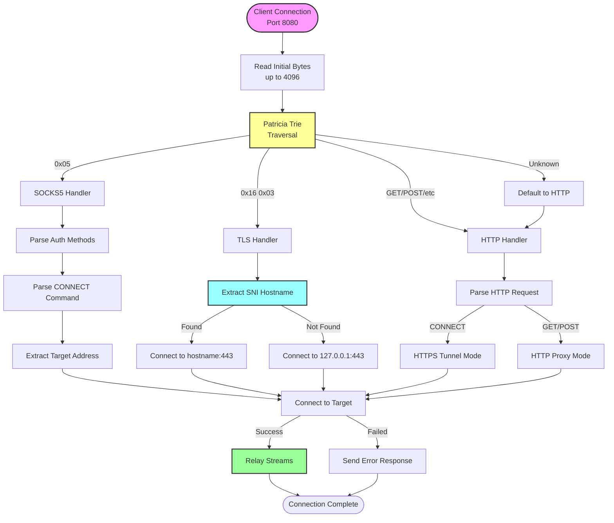

# LiteBike Network Utility

A comprehensive network utility bootloader that acts like a BIOS for network operations - detecting the environment and choosing optimal execution pathways to survive network lockdowns and restrictions. Also includes a high-performance proxy server with intelligent protocol detection using Patricia Trie-based pattern matching.

## Command Structure

```dot
digraph litebike_commands {
    rankdir=TB;
    node [shape=box, style=rounded];
    
    // Root command
    litebike [label="litebike\n-v, --verbose\n-h, --help\n-V, --version", style=filled, fillcolor=lightblue];
    
    // Main subcommands
    net [label="net\nNetwork interface and routing management"];
    proxy [label="proxy\nProxy server and client operations"];
    connect [label="connect\nConnection management and testing"];
    completion [label="completion\nBash completion utilities"];
    utils [label="utils\nLegacy network utility compatibility"];
    
    // Net subcommands
    net_interfaces [label="interfaces\nList and manage network interfaces"];
    net_routes [label="routes\nRouting table operations"];
    net_stats [label="stats\nNetwork statistics and monitoring"];
    net_discover [label="discover\nNetwork discovery and scanning"];
    
    // Interface subcommands
    interfaces_list [label="list\n-a, --all\n-f, --format FORMAT"];
    interfaces_show [label="show\nShow details for specific interface"];
    
    // Routes subcommands
    routes_list [label="list\n-4, --ipv4\n-6, --ipv6"];
    routes_test [label="test\n-c, --count COUNT"];
    
    // Stats subcommands
    stats_connections [label="connections\n-l, --listening\n-t, --tcp\n-u, --udp"];
    
    // Discover subcommands
    discover_hosts [label="hosts\n-r, --range CIDR\n-t, --timeout MS"];
    
    // Proxy subcommands
    proxy_server [label="server\n-p, --port PORT\n-b, --bind ADDRESS\n-d, --daemon"];
    proxy_client [label="client\n-s, --server HOST:PORT\n-L, --local-port PORT"];
    proxy_socks [label="socks\nSOCKS proxy operations"];
    
    // SOCKS subcommands
    socks_server [label="server\n-p, --port PORT\n-v, --version VERSION"];
    
    // Connect subcommands
    connect_repl [label="repl\n-p, --port PORT"];
    connect_ssh [label="ssh\n-p, --port PORT\n-u, --user USER"];
    connect_test [label="test\n-p, --port PORT\n-t, --timeout SECONDS"];
    
    // Completion subcommands
    completion_generate [label="generate\n-s, --shell SHELL"];
    completion_install [label="install\nInstall completion script to system"];
    
    // Utils subcommands (legacy compatibility)
    utils_ifconfig [label="ifconfig\n-a, --all"];
    utils_netstat [label="netstat\n-l, --listening\n-a, --all"];
    utils_route [label="route\nRouting table display"];
    utils_ip [label="ip\nIP configuration"];
    
    // IP subcommands
    ip_addr [label="addr\nAddress management"];
    ip_route [label="route\nRoute management"];
    
    // Connections
    litebike -> net;
    litebike -> proxy;
    litebike -> connect;
    litebike -> completion;
    litebike -> utils;
    
    net -> net_interfaces;
    net -> net_routes;
    net -> net_stats;
    net -> net_discover;
    
    net_interfaces -> interfaces_list;
    net_interfaces -> interfaces_show;
    
    net_routes -> routes_list;
    net_routes -> routes_test;
    
    net_stats -> stats_connections;
    
    net_discover -> discover_hosts;
    
    proxy -> proxy_server;
    proxy -> proxy_client;
    proxy -> proxy_socks;
    
    proxy_socks -> socks_server;
    
    connect -> connect_repl;
    connect -> connect_ssh;
    connect -> connect_test;
    
    completion -> completion_generate;
    completion -> completion_install;
    
    utils -> utils_ifconfig;
    utils -> utils_netstat;
    utils -> utils_route;
    utils -> utils_ip;
    
    utils_ip -> ip_addr;
    utils_ip -> ip_route;
}
```



## Features

- **Multi-Pathway Execution**: Direct syscalls, legacy binary execution, network REPL, SSH tunneling, shell fallback
- **Environment Detection**: Automatically adapts to constraints (no /proc, no root, Android/Termux, containers)
- **Legacy Compatibility**: Drop-in replacement for `ifconfig`, `netstat`, `route`, `ip`
- **Integrated Bash Completion**: Self-generating completion scripts with context-aware suggestions
- **Cross-Platform**: Works on Android/Termux, macOS, Linux without modification

## Installation

```bash
./setup-litebike-cli.sh                    # Builds everything + installs completions
export PATH="$(pwd)/target/release:$PATH"  # Add to PATH
```

## Usage Examples

### Modern Interface
```bash
# Network management
litebike net interfaces list
litebike net interfaces list --all --format json
litebike net routes list --ipv4
litebike net stats connections --listening
litebike net discover hosts --range 192.168.1.0/24

# Proxy operations
litebike proxy server --port 8080 --bind 0.0.0.0
litebike proxy client --server 192.168.1.1:8080 --local-port 1080
litebike proxy socks server --port 1080 --version 5

# Connection testing
litebike connect repl 192.168.1.1
litebike connect ssh 192.168.1.1 --user u0_a471 --port 8022
litebike connect test 8.8.8.8 --port 53
```

### Legacy Compatibility
```bash
# These work exactly like traditional utilities
ifconfig -a
netstat -tuln
route
ip addr show
```

### Bash Completion
```bash
# Generate completion script
litebike completion generate --shell bash

# Install completions system-wide
litebike completion install
```

## Network Security Benefits

Perfect for lockdown scenarios:

- **Multiple Attack Vectors**: If one pathway is blocked, automatically tries others
- **Stealth Operations**: Can operate through various channels (HTTP, SSH, direct syscalls)
- **Cross-Platform**: Works on Android/Termux, macOS, Linux without modification
- **No Dependencies**: Core functionality uses only syscalls, no external files needed

## Technical Architecture

### Execution Pathways

1. **Direct Syscalls**: Pure syscall implementation using libc for maximum reliability
2. **Legacy Binary Execution**: Falls back to system ifconfig/netstat/route/ip when available
3. **Network REPL**: Executes commands via HTTP REPL on litebike servers
4. **SSH Tunneling**: Routes commands through SSH connections
5. **Shell Fallback**: Last resort shell execution

### Environment Detection

Automatically detects and adapts to:
- No /proc filesystem (Android/Termux)
- No root privileges
- Container environments
- Network restrictions
- Missing system utilities

## Patricia Trie Protocol Detection

LiteBike uses an optimized Patricia Trie (radix tree) for ultra-fast protocol detection on port 8080. This enables single-port universal proxy support with minimal overhead.

### Protocol Detection Map



### Detection Performance

| Protocol | Bytes Needed | Detection Time | Pattern |
|----------|--------------|----------------|---------|
| SOCKS5   | 1            | O(1)          | `0x05` |
| TLS 1.0  | 3            | O(3)          | `0x16 0x03 0x01` |
| TLS 1.1  | 3            | O(3)          | `0x16 0x03 0x02` |
| TLS 1.2  | 3            | O(3)          | `0x16 0x03 0x03` |
| TLS 1.3  | 3            | O(3)          | `0x16 0x03 0x04` |
| HTTP GET | 4            | O(4)          | `GET` |
| HTTP PUT | 4            | O(4)          | `PUT` |
| HTTP POST| 5            | O(5)          | `POST` |
| HTTP HEAD| 5            | O(5)          | `HEAD` |
| HTTP DELETE | 7         | O(7)          | `DELETE` |
| HTTP CONNECT | 8        | O(8)          | `CONNECT` |
| HTTP OPTIONS | 8        | O(8)          | `OPTIONS` |

### Extended Protocol Support

The Patricia Trie can be extended for additional protocols:

```
Future Extensions:
├─ 0x00-0x04 → SOCKS4/4A (version bytes) 
├─ 0x15 → TLS Alert Protocol
├─ 0x17 → TLS Application Data
├─ 0x80-0x8F → Legacy SSL 2.0
├─ 'S' → Could map to:
│   ├─ "SSH-" → SSH Protocol
│   └─ "STARTTLS" → SMTP/IMAP upgrade
├─ 0x0D 0x0A → Could detect:
│   └─ "PROXY " → HAProxy PROXY protocol
└─ Binary patterns for:
    ├─ WebSocket upgrade sequences
    ├─ HTTP/2 preface ("PRI * HTTP/2.0")
    ├─ QUIC/HTTP/3 patterns
    └─ gRPC binary headers
```

### Memory Efficiency

The Patricia Trie structure uses approximately:

- **Base overhead**: ~200 bytes for the trie skeleton
- **Per node**: 24 bytes (HashMap entry + protocol enum)
- **Total for current protocols**: ~1KB
- **Lookup performance**: O(k) where k = protocol prefix length

### Implementation Details

```rust
// Trie node structure
struct TrieNode {
    children: HashMap<u8, Box<TrieNode>>,  // 24 bytes base
    protocol: Option<Protocol>,             // 2 bytes enum
    prefix_len: usize,                      // 8 bytes
}

// Protocol detection flow
1. Read first packet (up to 4096 bytes)
2. Traverse trie byte-by-byte
3. Return longest matching protocol
4. Fallback to bitwise quick detection
5. Route to appropriate handler
```

### Binary Protocol Formats

#### SOCKS5 Detection

```
Byte 0: Version (0x05)
├─ Detected immediately
└─ No further bytes needed
```

#### TLS/SSL Detection

```
Byte 0: Record Type (0x16 = Handshake)
Byte 1-2: Version (0x03 0x01/02/03/04)
├─ 0x03 0x00 = SSL 3.0
├─ 0x03 0x01 = TLS 1.0
├─ 0x03 0x02 = TLS 1.1
├─ 0x03 0x03 = TLS 1.2
└─ 0x03 0x04 = TLS 1.3
```

The following sequence diagram illustrates how the proxy detects a TLS handshake and extracts the SNI hostname during the initial client connection:



##### TLS Client Hello Structure

```mermaid
graph LR
    subgraph "TLS Record Header (5 bytes)"
        A[0x16<br/>Type] --> B[0x03 0x0X<br/>Version] --> C[Length<br/>2 bytes]
    end
    
    subgraph "Handshake Header (4 bytes)"
        C --> D[0x01<br/>Hello] --> E[Length<br/>3 bytes]
    end
    
    subgraph "Client Hello Body"
        E --> F[Version<br/>2 bytes]
        F --> G[Random<br/>32 bytes]
        G --> H[Session ID<br/>Variable]
        H --> I[Cipher Suites<br/>Variable]
        I --> J[Compression<br/>Variable]
        J --> K[Extensions<br/>Variable]
    end
    
    subgraph "SNI Extension"
        K --> L[Type: 0x0000<br/>2 bytes]
        L --> M[Length<br/>2 bytes]
        M --> N[List Length<br/>2 bytes]
        N --> O[Type: 0x00<br/>1 byte]
        O --> P[Name Length<br/>2 bytes]
        P --> Q[Hostname<br/>Variable]
    end
    
    style A fill:#f96,stroke:#333,stroke-width:2px
    style D fill:#f96,stroke:#333,stroke-width:2px
    style L fill:#9f6,stroke:#333,stroke-width:2px
    style Q fill:#69f,stroke:#333,stroke-width:2px
```



#### HTTP Method Detection

```
All HTTP methods end with space (0x20):
- "GET "     = 0x47 0x45 0x54 0x20
- "POST "    = 0x50 0x4F 0x53 0x54 0x20
- "CONNECT " = 0x43 0x4F 0x4E 0x4E 0x45 0x43 0x54 0x20
```

### Universal Protocol Flow on Port 8080



## Core Components

### PAC Server (Port 8888)

- Serves proxy auto-configuration file
- URL: `http://$TERMUX_HOST:8080/proxy.pac`

### Universal HTTP Proxy (Port 8080)

- Handles HTTP, HTTPS, and CONNECT tunneling
- Protocol detection on single port
- Bridges WiFi (swlan0) to mobile data (rmnet)

### Compliance Ports

Individual protocol ports for strict compliance requirements:

- **1080**: SOCKS5 (RFC 1928 compliant)  
- **8443**: Direct TLS proxy
- **3128**: Squid-compatible HTTP
- **1900**: UPnP/SSDP discovery ⚠️ **External Network Feature** - Enables automatic port forwarding
- **5353**: Bonjour/mDNS discovery ⚠️ **External Network Feature** - Enables service discovery

## Network Access Configuration

🌐 **INTENTIONAL DESIGN**: This proxy is designed to share network access across interfaces:

### Network Binding Options
```bash
# EXTERNAL ACCESS (default): Share with other devices on network/internet
BIND_IP=0.0.0.0 litebike-proxy  # ✅ FEATURE: External device access

# LOCAL ONLY: Restrict to current device only  
BIND_IP=127.0.0.1 litebike-proxy  # Localhost only

# NETWORK SPECIFIC: Bind to specific interface
BIND_IP=192.168.1.100 litebike-proxy  # Specific local network IP
```

### Discovery Protocol Features

#### UPnP/SSDP Port Forwarding (Port 1900)
- **Automatic NAT traversal** for external device access
- **Mobile data sharing** through WiFi hotspot routing
- **Remote proxy discovery** via UPnP protocol
- **Disable in untrusted environments** if security is a concern

#### Bonjour/mDNS Service Discovery (Port 5353)
- **Automatic proxy discovery** on local networks
- **Zero-configuration networking** for seamless setup
- **Service announcement** via multicast DNS
- **Local domain resolution** (.local domains)

### Deployment Scenarios

#### ✅ **Mobile Data Sharing (Primary Use Case)**
```bash
# Termux on Android - Share mobile data via WiFi
BIND_IP=0.0.0.0 litebike-proxy
# Other devices connect to your phone's WiFi and use proxy
```

#### ✅ **Home Network Proxy**
```bash
# Share internet connection with devices on home network
BIND_IP=0.0.0.0 litebike-proxy  
# Devices on 192.168.x.x network can use proxy
```

#### ⚠️ **Restricted/Corporate Networks**
```bash
# Disable external access features in sensitive environments
export BIND_IP="127.0.0.1"     # Local only
export DISABLE_UPNP="true"     # No automatic port forwarding
litebike-proxy
```

### Security vs Functionality Trade-offs
- **Default configuration prioritizes functionality** (external access)
- **Security restrictions available** when needed
- **Firewall rules can add additional protection**
- **Authentication could be added** for enhanced security

## Client Configuration

### Automatic (via PAC)

```
Proxy Auto-Config URL: http://$TERMUX_HOST:8080/proxy.pac
```

### Manual

```
HTTP Proxy:  $TERMUX_HOST:8080
HTTPS Proxy: $TERMUX_HOST:8080
badass SOCKS Proxy: $TERMUX_HOST:8080
discrete SOCKS Proxy: $TERMUX_HOST:1080
```

## Sample PAC File

```javascript
function FindProxyForURL(url, host) {
  if (isInNet(host, "10.0.0.0", "255.0.0.0"))
    return "DIRECT";
  return "PROXY $TERMUX_HOST:8080; SOCKS $TERMUX_HOST:1080; DIRECT";
}
```

## Proxy Bridge Script

The included `scripts/proxy-bridge` script provides comprehensive proxy management:

- Auto-discovery of gateway IPs
- SSH remote server startup
- System-wide proxy configuration for macOS/Linux
- Developer tool integration (git, npm, curl, VSCode, etc.)

See [scripts/proxy-bridge](scripts/proxy-bridge) for detailed usage.

## Architecture

Litebike uses Tokio for async I/O and implements both HTTP CONNECT tunneling and SOCKS5 protocol handling in a single binary. The design prioritizes:

1. **Performance**: Minimal overhead, efficient buffer management
2. **Compatibility**: Works with mobile platform restrictions
3. **Flexibility**: Configurable routing for complex network setups
4. **Simplicity**: Single binary, no external dependencies

## Installation

### Termux (Android)

```bash
curl -sL https://github.com/jnorthrup/litebike/raw/master/termux-package/build-on-termux.sh | bash
```

### Desktop/Server

Requirements: Rust 1.70+ with cargo

```bash
git clone https://github.com/jnorthrup/litebike.git
cd litebike
cargo build --release
```

## License

**Licensed under AGPL-3.0** with commercial licensing available.

### 🔓 AGPL-3.0 (Default)
- **✅ FREE** for personal, educational, and research use
- **✅ FREE** for commercial use **IF** you open source your entire application  
- **⚠️ NETWORK COPYLEFT**: SaaS/hosting **REQUIRES** making source code available
- **⚠️ MODIFICATIONS**: Must be released under AGPL-3.0

### 💼 Commercial License Alternative
- **🔓 Proprietary use** without open source requirements
- **🚀 SaaS/hosting** without source code disclosure  
- **🏢 Enterprise deployment** with full commercial rights
- **🤝 Priority support** and consulting services

**Contact**: For commercial licensing, open a GitHub issue with "Commercial License" tag.

**Details**: See [LICENSE](LICENSE) file for complete terms.

## Contributing

Contributions welcome! Please submit pull requests or issues on GitHub

## Termux-Specific Notes

- $TERMUX_HOST: Auto-detected swlan0 IP address
- Ingress: WiFi interface (swlan0)
- Egress: Mobile data (rmnet_data*)
- Purpose: Share mobile data via WiFi proxy bridge
