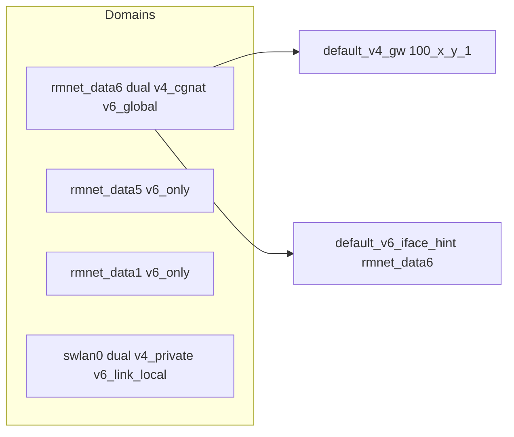
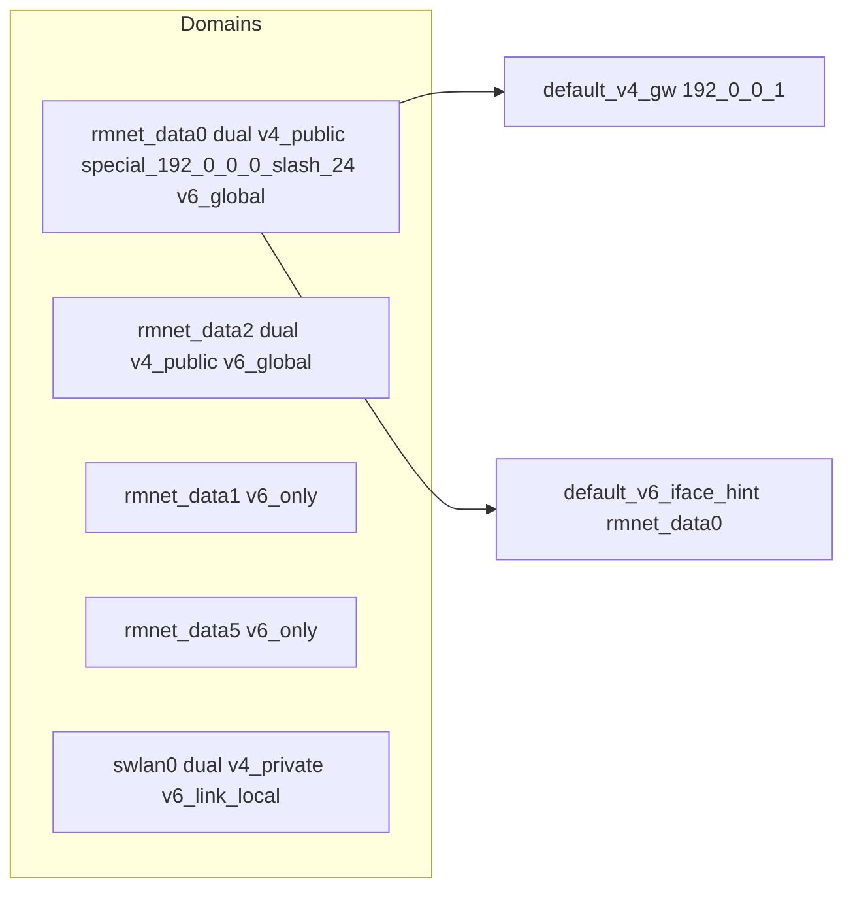

# Carrier profiles (Mermaid collection)

This document collects per-carrier network profiles as simple Mermaid diagrams for quick, side‑by‑side comparison. Labels are sanitized for Mermaid (underscores, no parentheses) to avoid parse issues.

## Profiles overview

```mermaid
flowchart TB
  classDef v4 fill:#e3f2fd,stroke:#64b5f6,stroke-width:1px
  classDef v6 fill:#e8f5e9,stroke:#81c784,stroke-width:1px
  classDef warn fill:#fff8e1,stroke:#ffb300,stroke-width:1px

  subgraph Xfinity_Unlimited_ESIM
    direction TB
    XU_v4_cgnat[IPv4 CGNAT 100_64_0_0_slash_10]:::v4
    XU_v6_global_cell[IPv6 global on cell]:::v6
    XU_wifi_v6_link_local[WiFi IPv6 link_local only]:::warn
    XU_default_v4_gw[Default v4 gateway 100_x_y_1]:::v4
    XU_v6_egress_iface[IPv6 egress iface rmnet_data6]:::v6
  end

  subgraph Google_Fi_SIM
    direction TB
    GFi_v4_public_cell[IPv4_public_on_cell_192_0_0_0_slash_24_special]:::v4
  GFi_v6_global_cell[IPv6 global on cell]:::v6
  GFi_wifi_v6_link_local[WiFi IPv6 link_local only]:::warn
  GFi_default_v4_gw[Default v4 gateway 192_0_0_1]:::v4
  GFi_v6_egress_iface[IPv6 egress iface rmnet_data0]:::v6
  end
```

Notes

- Xfinity_Unlimited_ESIM reflects the current ESIM snapshot on the device: IPv4 via CGNAT on cellular, IPv6 global on cellular only; WiFi shows IPv6 link_local (no global v6).
- Default IPv4 gateway derived from local CGNAT address (x_y_z_1 heuristic when hidden by policy).
- IPv6 default often hidden; egress interface hint points to the active rmnet_dataN.

## Xfinity_Unlimited_ESIM details

## Google_Fi_SIM_Tethering_PostQuota details

## How to add a new profile

- On the device (or managed host), run: `snapshot <Label Words>` to save a point‑in‑time profile under `docs/snapshots/`.
- Add a new subgraph above named after your label (sanitize spaces to underscores) and summarize:
  - IPv4: private/public/CGNAT; default gateway visibility
  - IPv6: global/ULA/link_local; whether only on cellular
  - WiFi/VPN presence and modes (v4‑only, v6‑only, dual)
  - Egress hints if defaults are hidden
- Keep labels simple (underscores, no punctuation that confuses Mermaid).

## Snapshots

- Snapshot artifacts are written to `docs/snapshots/` by the `snapshot` subcommand. Commit selected snapshots for history and diffs.

---

See also: `docs/NETWORK_DOMAINS.md` for the per‑network domain model and routing behavior notes.
